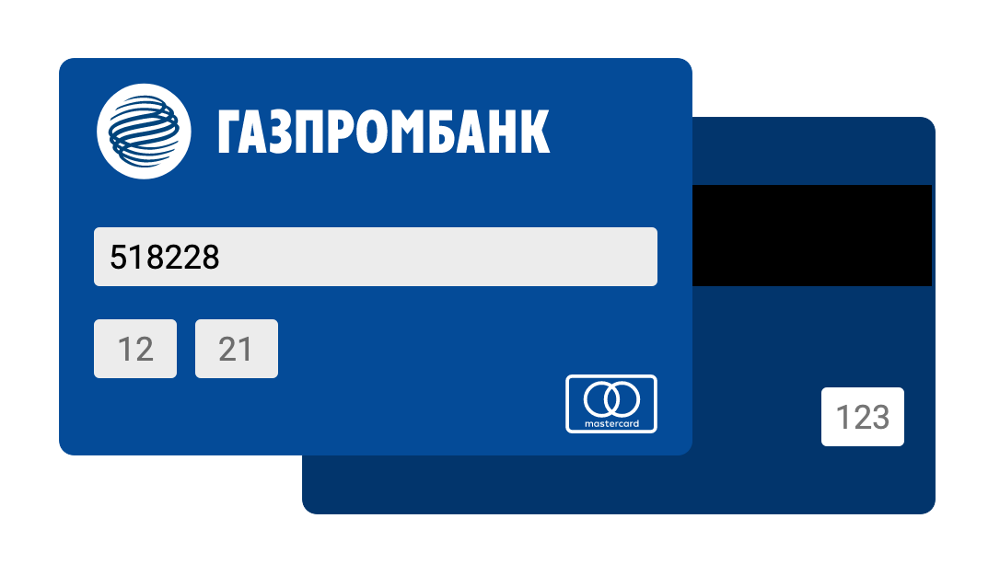

### CardForm

Это html форма которая меняется когда пользователь вводит первые 6 цифр, по первым 6 цифрам можно определить банк карты и платёжную систему 

Например:

| Просто форма | 5213 24XX XXXX XXXX | 4276 81XX XXXX XXXX | 5123 94XX XXXX XXXX |
| :---: | :---: | :---: | :---: |
|  |  |  | |

| 2200 20XX XXXX XXXX | 5182 28XX XXXX XXXX | 6776 84XX XXXX XXXX | 5187 74XX XXXX XXXX |
| :---: | :---: | :---: | :---: |
|  |  |  | |
