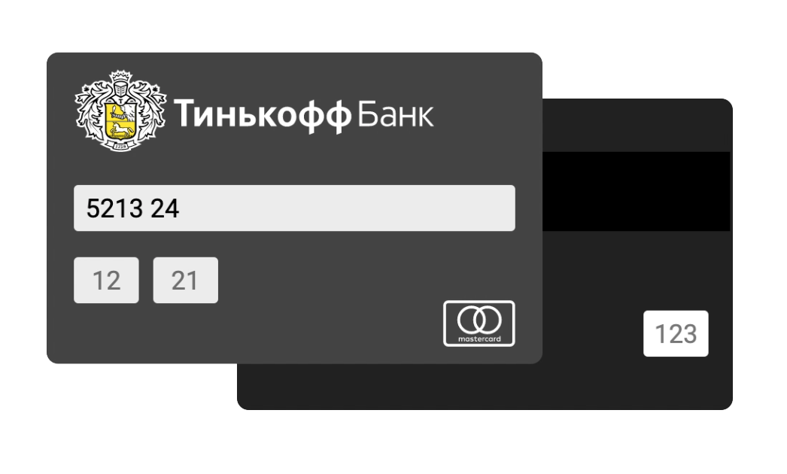
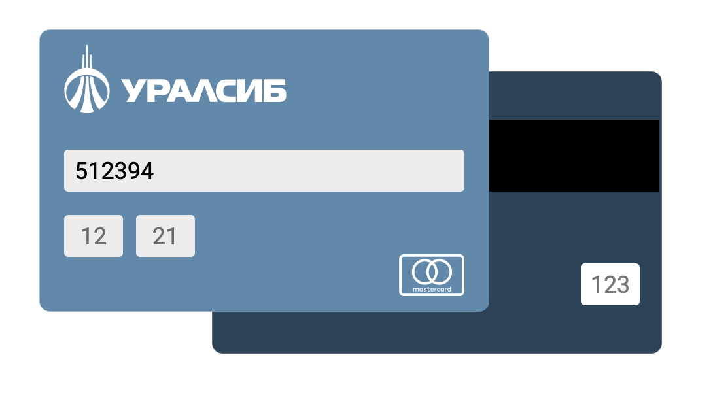

### CardForm

Это html форма которая меняется когда пользователь вводит первые 6 цифр, по первым 6 цифрам можно определить банк карты и платёжную систему 

Например:

| Просто форма | 5213 24XX XXXX XXXX | 4276 81XX XXXX XXXX | 4392 43XX XXXX XXXX |
| :---: | :---: | :---: | :---: |
|  |  |  | |

